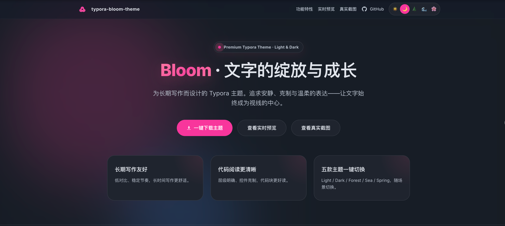

# 🌸 Bloom · The Art of Writing

<p align="center">
  
</p>

<p align="center">
  
  
  
  
  <a href="README.md"></a>
</p>

---

**Bloom** is a premium Typora theme specifically crafted for **long-form writing**.

In an era of information noise, we return to the words themselves. Bloom pursues a quiet, restrained, and gentle expression—avoiding over-decoration to ensure your thoughts find a fertile ground behind the digital paper.

> *"All great writing deserves to breathe slowly, in the most suitable light."*

[Official Preview](https://typora-bloom-theme.webkubor.online) | [Live Showcase](https://typora-bloom-theme.webkubor.online/showcase.html)

---

## ✨ Features

### 🎨 The Breath of Morandi: 16-Theme Matrix
Bloom features **8 Light and 8 Dark** palettes. From the morning glow of "Petal Pink" to the deep tranquility of "Ripple Dark," every color is meticulously tuned to ensure your eyes and mind find sanctuary during long writing sessions.

### 🌈 OKLCH: Perceptual Science Meets Aesthetics
We have fully migrated to the **OKLCH color space**. Unlike traditional RGB, OKLCH strictly follows the laws of human visual perception. This allows Bloom to maintain consistent visual lightness and weight across all theme variations.

### 🧊 Glassmorphism Callouts
In v1.3.1, we evolved callouts into a **"Frosted Glass"** aesthetic. Using `color-mix` for dynamic transparency, these alerts feature 12px rounded corners and a subtle breathing border—turning information into elegant footnotes.

### 🍎 Unified Aesthetics (v1.3.4 New)
We have achieved a **Unified Aesthetic** across **Code Fences**, **HTML Blocks**, and **YAML Frontmatter**. They now share the iconic 18px rounded corners, Mac-style "Red-Yellow-Green" dots, and a consistent background logic, eliminating visual fragmentation.

### 📐 8px Rhythm: Atomic Spacing System
A rigorous **8px atomic spacing system** brings a sense of "air" to your documents. The restraint in headings, the negative space in paragraphs, and the breath of code blocks all achieve a dynamic visual balance.

---

## 🎨 Gallery

| 🌤 Light Variants | 🌙 Dark Variants |
| :--- | :--- |
| **Petal** - Warm Pink-White, soft as porcelain | **Petal Dark** - Deep Rose Black |
| **Mist** - Scandinavian Grey, cold and premium | **Mist Dark** - Deep Nordic Blue |
| **Verdant** - Healing Sage Green | **Verdant Dark** - Midnight Forest |
| **Ink** - Oriental Minimalism, Cinnabar touch | **Ink Dark** - Lacquer Texture |
| ... *and more: Stone, Amber, Spring, Ripple* | ... *and corresponding Dark versions* |

---

## 🚀 Installation

1.  **Download**: Visit [Releases](https://github.com/webkubor/typora-Bloom-theme/releases/latest) and download `Bloom-theme.zip`.
2.  **Locate Folder**: In Typora, go to `Preferences` -> `Appearance` -> `Open Theme Folder`.
3.  **Deploy Assets**: Copy all `bloom-*.css` files and the `bloom/` folder into the directory.
4.  **Begin Writing**: Select your desired Bloom variant from the `Themes` menu.

---

## 🛠 Developer Guide

If you wish to cultivate this soil:

- **`theme-src/`**: The root of the source.
- **`scripts/`**: Automation build tools.

```bash
# Sowing (Install)
pnpm install

# Sprouting (Live Preview)
npm run dev

# Harvest (Build)
npm run build
```

---

## 📃 Changelog

- **v1.3.4**: **Unified Aesthetics Batch**. Unified visual language for Code, HTML, and YAML; Native GitHub Alert syntax support; Fixed dark mode Mermaid visibility and macOS title bar contrast.
- **v1.3.3**: Fixed macOS title bar contrast and refactored Dark Mermaid variables.
- **v1.3.1**: Upgraded Glassmorphism Alert system.

---

## 💖 Philosophy

This theme was born after I became a father. I began to value time, companionship, and the words that are read over and over again.

If this theme allows you to write a few more lines of quiet reflection in a noisy world, then its mission is accomplished.

**License**: [MIT](LICENSE)  
**Author**: [webkubor](https://github.com/webkubor)
