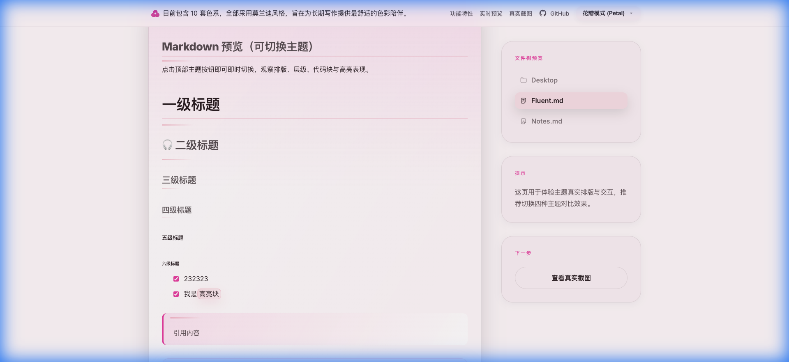
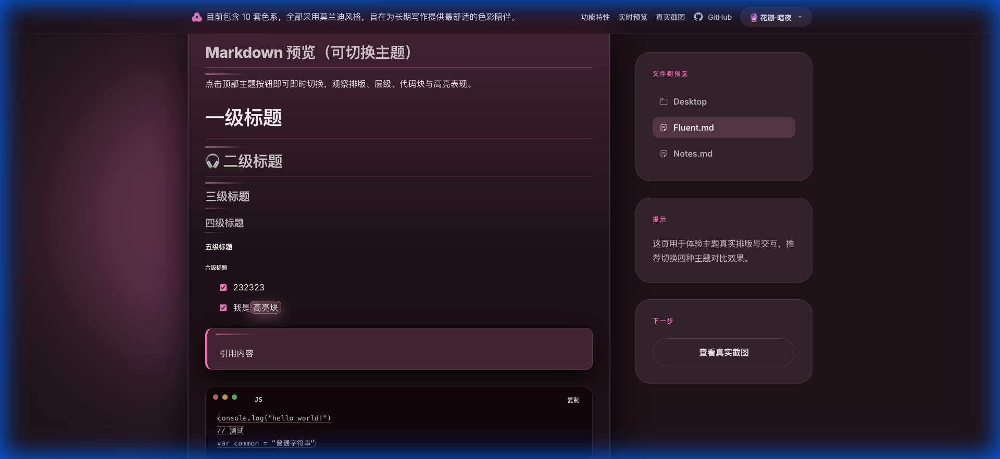
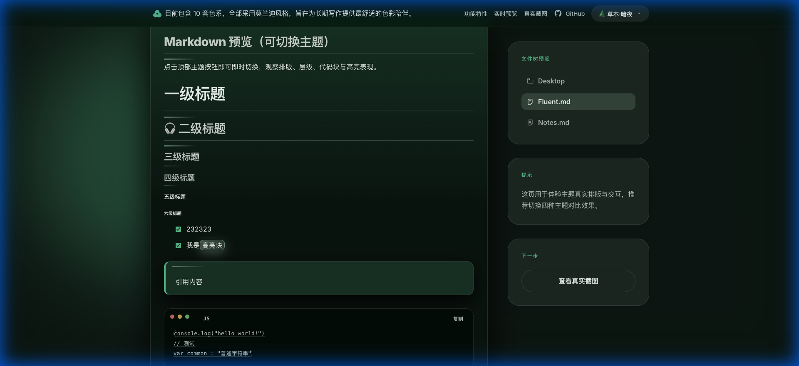

# Bloom · Typora Theme

  

官网预览：<https://typora-bloom-theme.netlify.app/>

Bloom（绽放）是一套为**长期写作**设计的 Typora 主题。它追求安静、克制与温柔的表达——不过度装饰，不喧宾夺主，让文字始终成为视线的中心。

目前包含 **11 套精心调配的莫兰迪配色**（5 套浅色 + 6 套深色）：
- **浅色系**：花瓣 (Petal), 雾蓝 (Mist), 草木 (Verdant), 暖石 (Stone), 琥珀 (Amber)
- **深色系**：花瓣暗夜 (Petal Dark), 雾蓝暗夜 (Mist Dark), 草木暗夜 (Verdant Dark), 琥珀暗夜 (Amber Dark), 青蓝 (Cyber), 薰衣草紫 (Spring)

---

## 主题系列 (Theme Variants)

所有主题均基于 **OKLCH 色彩空间** 重新设计，统一莫兰迪低饱和风格，极致护眼。

### 🎨 配色方案总览

| 分类 | 主题 | 背景 (Bg) | 强调色 (Accent) | 文字 (Text) | 风格描述 |
|:---|:---|:---|:---|:---|:---|
| **🌤 浅色 (5)** | **花瓣 Petal** | `L98% C0.01 H350` | `L64% C0.22 H350` | `L25% C0.02 H350` | 暖粉白 + 玫瑰粉 · 柔和温润 |
| | **雾蓝 Mist** | `L96% C0.01 H240` | `L50% C0.08 H240` | `L25% C0.02 H240` | 冷浅灰 + 深雾蓝 · 深邃克制 |
| | **草木 Verdant** | `L96% C0.01 H160` | `L50% C0.07 H160` | `L25% C0.02 H160` | 极浅淡绿 + 豆沙绿 · 治愈草木色 |
| | **暖石 Stone** | `L96% C0.01 H60` | `L50% C0.06 H40` | `L25% C0.02 H40` | 暖米白 + 红棕土 · 温润如陶瓷 |
| | **琥珀橙 Amber Orange** | `L98% C0.01 H65` | `L60% C0.14 H65` | `L25% C0.02 H65` | 现代琥珀橙，清爽有活力的写作体验 |
| **🌙 深色 (5)** | **花瓣暗夜 Petal Dark** | `L20% C0.02 H350` | `L75% C0.18 H350` | `L98% C0.01 H350` | 深玫瑰黑 + 玫瑰粉 · 安静的夜间粉调 |
| | **雾蓝暗夜 Mist Dark** | `L20% C0.02 H240` | `L72% C0.12 H240` | `L96% C0.01 H240` | 莫兰迪雾蓝暗色版，护眼且深邃 |
| | **草木暗夜 Verdant Dark** | `L18% C0.02 H160` | `L72% C0.12 H160` | `L96% C0.01 H160` | 深墨绿 + 莫兰迪绿 · 幽静的暗夜森林 |
| | **琥珀橙暗夜 Amber Orange Dark** | `L20% C0.02 H65` | `L75% C0.16 H65` | `L98% C0.01 H65` | 篝火般的琥珀橙，高对比度极客风 |
| | **薰衣草紫 Spring** | `L18% C0.02 H295` | `L75% C0.14 H295` | `L96% C0.01 H295` | 深紫黑 + 薰衣草紫 · 浪漫的夜间花海 |

---

## 视觉与设计

### 设计原则
1. **文字优先**：所有设计都应为内容让路，不抢表达。
2. **长期可用**：不追求第一眼的惊艳，而追求数小时使用后的舒适。
3. **感知均匀**：利用 OKLCH 色彩空间，确保不同色调在视觉亮度上保持一致。
4. **层级分明**：标题、引用、代码块采用层级递进，而非跳色区分。

### 细节把控
- **排版**：行距偏松，标题不过度放大，避免“PPT 感”。
- **图标**：风格简洁、线性，UI 元素尽量退后。
- **动效**：微妙的平滑过渡，让写作体验更具呼吸感。

---

## 安装方式

1. 打开 Typora，进入 **偏好设置 → 外观 → 打开主题文件夹**。
2. 将 `dist/` 目录下的 `.css` 文件复制到该文件夹中。
3. 如果存在 `bloom/` 文件夹（图标资源），也请一并复制。
4. 在 Typora **主题** 菜单中选择对应名称即可。

> [!TIP]
> 推荐从 [Releases](https://github.com/webkubor/typora-Bloom-theme/releases/latest) 下载打包好的 `Bloom-theme.zip`，解压即用。

---

## 致谢

这个主题诞生于我成为父亲之后。我开始更加在意时间、陪伴，以及那些会被反复翻阅的文字。

感谢所有使用、反馈与分享 Bloom 的人。如果这个主题在某个清晨或夜晚让你愿意多写几行字，那它的意义就已经成立了。
