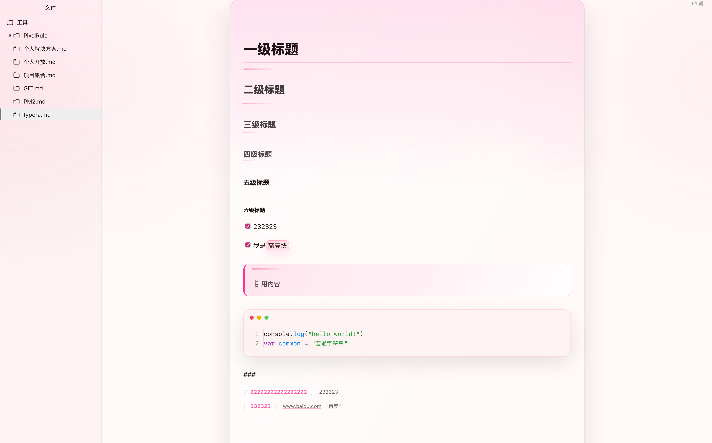
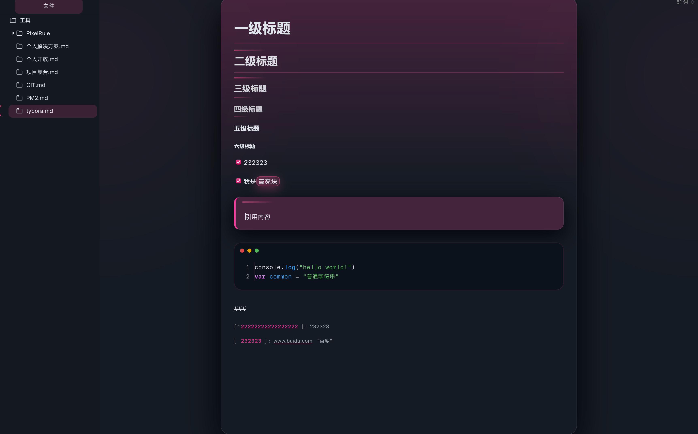
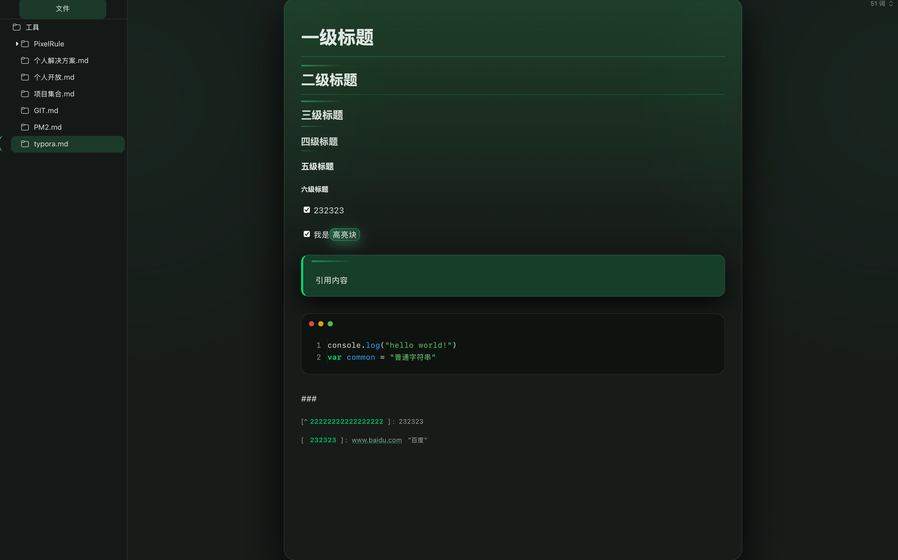
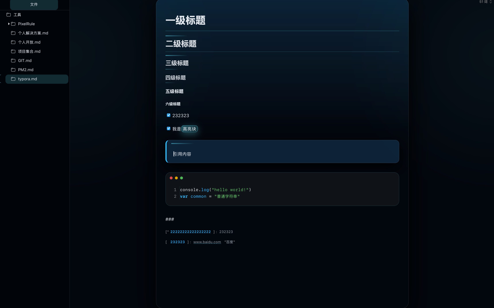
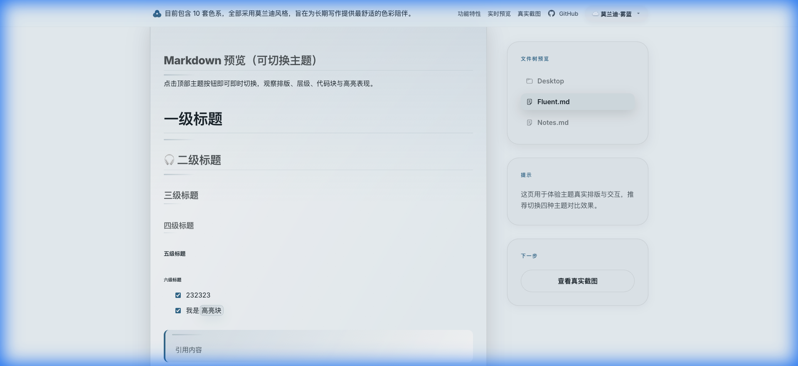
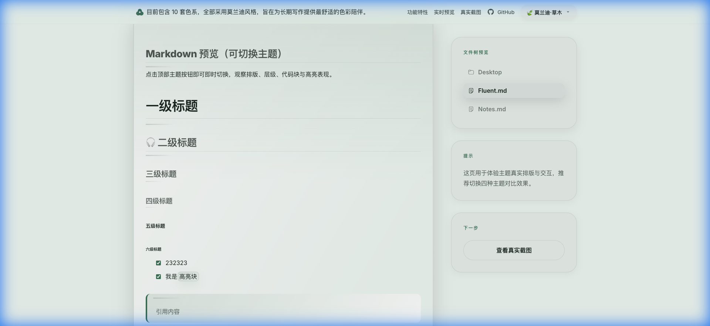
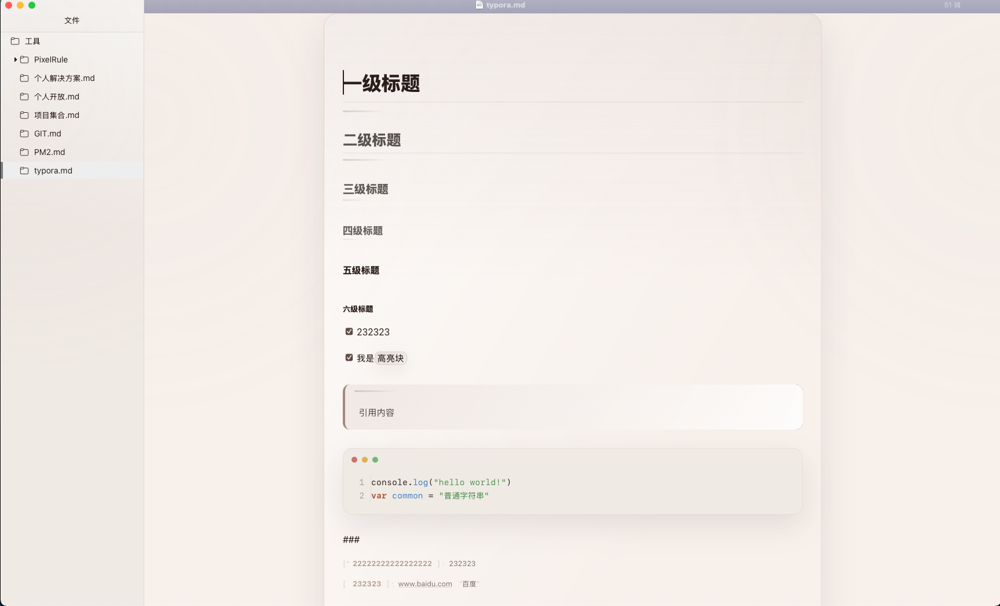

# Bloom · Typora Theme

  

官网预览：<https://typora-bloom-theme.netlify.app/>

Bloom（绽放 / 成长）是一套为**长期写作**而设计的 Typora 主题。
它包含八套主题：
- **经典系列**：**Bloom Light（浅色）**、**Bloom Dark（深色）**、**Bloom Forest（森林绿）**、**Bloom Cyber（荧光蓝）**、**Bloom Spring（粉紫）**。
- **莫兰迪系列**：**Bloom Mist（雾蓝）**、**Bloom Verdant（草木绿）**、**Bloom Stone（暖石灰）**。

它追求安静、克制与温柔的表达——  
不过度装饰，不喧宾夺主，  
让文字始终成为视线的中心。

Bloom 适合那些需要**长时间阅读、记录、思考**的人。

这个主题诞生的时间，正好是我成为父亲之后。  
我开始更加在意时间、陪伴，以及那些会被反复翻阅的文字。

希望 Bloom 能像它的名字一样，  
在合适的光线里，慢慢生长。

---

## 设计理念

Bloom 的设计灵感来自「一天的光」。

- 清晨的自然明亮  
- 夜晚的安静专注  

因此，它包含两套基础主题，并提供两种深色变体：

- **Bloom Light** —— 清晨  
  清晰、柔和、低对比，适合白天阅读与整理思路  

- **Bloom Dark** —— 夜晚  
  克制、沉稳、护眼，适合夜间长时间写作  

- **Bloom Forest** —— 森林  
  深色基底，强调色偏绿，氛围更沉静  

- **Bloom Cyber** —— 荧光蓝  
  深色基底，辅以高亮度的电学/赛博蓝，具有极强的反光质感与顶级对比度。  

- **Bloom Spring** —— 春季  
  深色基底，带有浪漫的粉紫色调  

### 莫兰迪系列 (Morandi Series)

莫兰迪色系以其低饱和度、带有灰调的色彩著称，旨在提供更高级的视觉质感和极佳的长时阅读舒适度：

- **Bloom Mist** —— 雾蓝  
  清冷、沉静，如薄雾笼罩的海面，最适合深度思考。
- **Bloom Verdant** —— 草木  
  柔和、治愈的豆沙绿，能有效缓解视觉疲劳。
- **Bloom Stone** —— 暖石  
  温润、极简的中性灰调，像米色的陶瓷，是最经久耐用的背景。

八套主题在排版、比例、节奏上保持一致，只改变色彩氛围。

---

## 设计原则

Bloom 不是为了展示设计本身，而是为了陪伴写作。

它遵循以下原则：

1. **文字优先**
   所有设计都应为内容让路。
   主题不抢表达，不制造存在感，只负责让文字被更好地阅读。

2. **长期可用**
   Bloom 不追求第一眼的惊艳，
   而追求在数小时、数月、甚至数年使用后，依然愿意打开。

3. **克制而非贫乏**
   颜色、装饰与强调都被谨慎使用。
   不是因为不能多，而是因为不需要多。

4. **情绪稳定**
   不追逐流行配色，
   不制造刺激对比，
   让界面在白天与夜晚都保持平和。

5. **尊重时间**
   写作是一件缓慢的事。
   Bloom 相信，值得被记录的内容，也值得一个安静的界面。

Bloom 试图成为这样一种存在：
当你专注于文字时，几乎感觉不到它；
当你回头翻阅时，又庆幸它一直在那里。

## 颜色与视觉

- 使用**单一强调色（Accent）**贯穿全局  
- 避免高饱和与强对比，保证长时间观看不疲劳  
- 标题、引用、代码块均采用层级递进，而非跳色区分  
- 所有颜色均采用 **OKLCH 色彩空间**，确保感知均匀性

你只需要修改一个变量，即可让整套主题呈现新的气质。

---

### 配色方案总览

#### 🌤 浅色系 (Light Series)

| 主题 | 背景色 (`--bg`) | 文字色 (`--text`) | 主题色 (`--accent`) | 风格描述 |
|:---|:---|:---|:---|:---|
| **Light** | `oklch(99% 0.01 20)` | `oklch(20% 0.02 20)` | `oklch(66% 0.24 354)` | 几近纯白 + 深暖灰 + **活力粉** · 高对比度经典亮色 |
| **Mist** | `oklch(96% 0.01 240)` | `oklch(25% 0.02 240)` | `oklch(50% 0.08 240)` | 冷调浅灰 + 深冷灰 + **深雾蓝** · 莫兰迪雾霭感 |
| **Stone** | `oklch(96% 0.01 60)` | `oklch(25% 0.02 40)` | `oklch(50% 0.06 40)` | 暖调米白 + 深褐灰 + **深棕土色** · 莫兰迪纸质感 |
| **Verdant** | `oklch(96% 0.01 160)` | `oklch(25% 0.02 160)` | `oklch(50% 0.07 160)` | 极浅淡绿 + 深墨绿 + **深草绿** · 莫兰迪清新自然 |

#### 🌙 深色系 (Dark Series)

| 主题 | 背景色 (`--bg`) | 文字色 (`--text`) | 主题色 (`--accent`) | 风格描述 |
|:---|:---|:---|:---|:---|
| **Dark** | `oklch(14% 0.02 260)` | `oklch(92% 0.01 260)` | `oklch(66% 0.24 354)` | 深邃蓝黑 + 亮白 + **活力粉** · 经典深色模式 |
| **Cyber** | `oklch(12% 0.02 245)` | `oklch(92% 0.01 240)` | `oklch(75% 0.14 230)` | 极深蓝黑 + 冷白 + **柔和青蓝** · 赛博朋克风格 |
| **Forest** | `oklch(14% 0.01 160)` | `oklch(92% 0.01 160)` | `oklch(76% 0.22 155)` | 深邃苔绿 + 亮绿白 + **荧光绿** · 暗夜森林风 |
| **Spring** | `oklch(14% 0.02 295)` | `oklch(92% 0.01 295)` | `oklch(68% 0.14 295)` | 深邃紫黑 + 亮紫白 + **薰衣草紫** · 浪漫暗夜风 |

---

### OKLCH 色彩解读

每个颜色值 `oklch(L% C H)` 的含义：
- **L (Lightness)**: 亮度，0% = 纯黑，100% = 纯白
- **C (Chroma)**: 饱和度/彩度，0 = 灰色，值越大颜色越鲜艳
- **H (Hue)**: 色相角度，0-360 度色环

| 色相范围 | 对应颜色 |
|:---:|:---|
| 0-30 | 红 → 橙 |
| 30-90 | 橙 → 黄 |
| 90-150 | 黄 → 绿 |
| 150-210 | 绿 → 青 |
| 210-270 | 青 → 蓝 |
| 270-330 | 蓝 → 紫 |
| 330-360 | 紫 → 红 |

---

### 设计特点

🌤 **Bloom Light（清晨）**
- 不是纯白，有纸感
- 对比不强，但清晰
- 很适合白天整理、阅读

🌙 **Bloom Dark（夜晚）**
- 非纯黑，护眼
- 文本偏暖灰，不刺眼
- Accent 会"发光但不跳"

🍃 **莫兰迪系列（Mist / Stone / Verdant）**
- 低饱和度，灰调色彩
- 极致护眼，适合长时间阅读
- 高级质感，不易审美疲劳”

---

## 字体与排版

Bloom 不强制绑定字体，但在设计时遵循以下原则：

- 行距偏松，适合长段阅读  
- 标题不过度放大，避免“PPT 感”  
- 中文与英文混排保持节奏统一  
- 列表、引用、代码块保持视觉连续性  

它不是为“截图好看”而设计，而是为**每天都愿意用**。

---

## 图标与细节

- 图标风格简洁、线性、低存在感  
- UI 元素尽量退后，为内容让路  
- 所有装饰都服务于阅读，而非展示  

Bloom 希望你在使用时，**几乎感受不到主题本身的存在**。

---

## 安装方式

1. 打开 Typora  
2. 进入：**偏好设置 → 外观 → 打开主题文件夹**  
3. 将以下文件复制到主题文件夹中：

   - `bloom-light.css`  
   - `bloom-dark.css`  
   - `bloom-forest.css`  
   - `bloom-sea.css`  

4. 回到 Typora：**主题 → 选择对应主题名称**

### 从 Releases 下载（推荐）

1. 进入本仓库的 **Releases** 页面
2. 下载最新的 `Bloom-theme.zip`
3. 解压后，将以下内容复制到 Typora 主题文件夹：

   - `bloom-light.css` / `bloom-dark.css` / `bloom-forest.css` / `bloom-cyber.css` / `bloom-spring.css`
   - `bloom-mist.css` / `bloom-verdant.css` / `bloom-stone.css`
   - `bloom/`（如存在）

---

## 在线预览
- **官方演示：** [https://typora-bloom-theme.netlify.app](https://typora-bloom-theme.netlify.app)
- **GitHub Pages：** 推送到 `main` 后会自动部署。

## 致谢

感谢所有使用、反馈与分享 Bloom 的人。

如果这个主题在某个清晨或夜晚  
让你愿意多写几行字，  
那它的意义就已经成立了。
