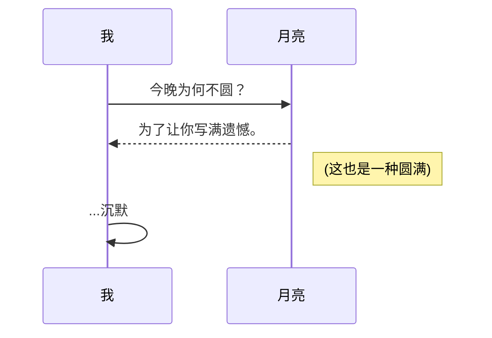

# 今晚把心事写慢一点

## 随手记

有些话不适合发出去，就写给自己看。  
不求惊艳，只希望久一点之后再读，仍能认出那天的自己。  
心情是==淡淡的==，像雨停之后的风。

### 小清单

- [x] 给自己一点耐心  
- [x] 把“还好”写成“我可以”  
- [ ] 允许今天慢一点  

### 情绪片段

- 今晚的歌单循环到第二遍，才发现我一直在和自己和解  
- 不解释也没关系，字会懂  
- 把喜欢藏在句子里，也算拥抱  

### 一段引用

> “后来才明白，很多事不是想通了，而是算了。”  
> —— 像网易云热评的那种句子

### 小代码

```javascript
const night = "quiet";
const heart = "soft";
console.log(`今晚的心情：${night} / ${heart}`);
```

> [!NOTE]
> 今晚的月亮不圆，但刚好适合写句子。

> [!TIP]
> 写完这一段，算今天的小胜利。

> [!WARNING]
> 不要把“我很好”写成习惯，字会信以为真。

> [!CAUTION]
> 别为了取悦谁删掉自己，草稿也要留一点真实。

## 图表 (Mermaid)


